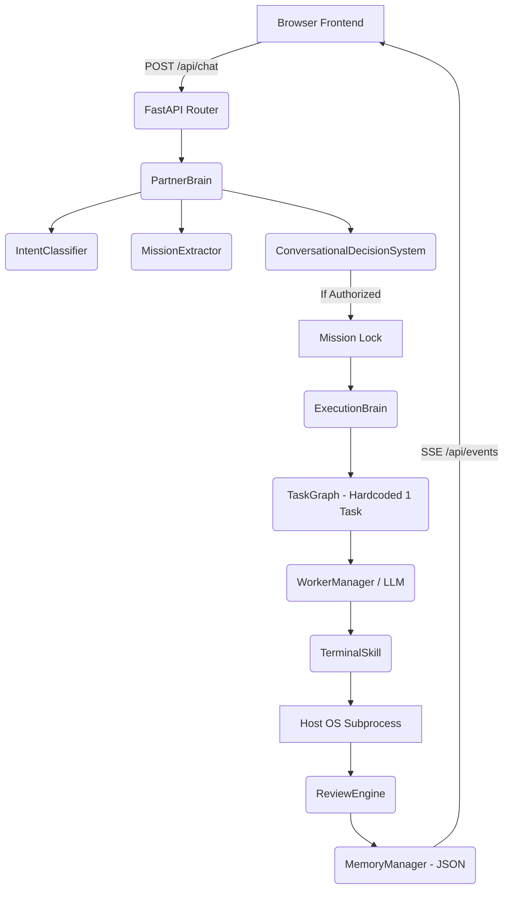

# HADES — CURRENT-STATE ENGINEERING AUDIT

## 1. Executive Summary

This report is a brutally honest, evidence-based assessment of the current state of Project Hades, inspecting the actual codebase rather than relying on architectural intent. 

**What is Hades right now?**
Hades is a functioning, but immature, prototype of a conversational AI agent designed to execute local shell commands. It consists of a React frontend connected via REST and Server-Sent Events (SSE) to a FastAPI Python backend. The backend utilizes LLMs (via LiteLLM) to parse user intent, construct a mission objective, and execute bash commands on the host machine. 

**What can Hades actually do today?**
Hades can hold a conversation, extract an objective into a structured mission state, determine when it has enough information to proceed ("Mission Lock"), and execute a single generated bash command in the background to achieve that objective. It can then report the result back to the user and save the outcome to a local JSON file.

**What cannot it do?**
It cannot generate complex, multi-step plans dynamically (the planner currently hardcodes a single task). It does not have real worker sandboxing or isolation (commands run on the host). It lacks a vector database or semantic retrieval for long-term memory. It lacks backend speech-to-text (relying entirely on the browser's Web Speech API). 

**Overall Implementation Maturity Assessment:**
- CORE FUNCTIONALITY: 60%
- FRONTEND: 75%
- BACKEND: 65%
- AI/LLM: 70%
- MISSION SYSTEM: 80%
- MEMORY: 20%
- WORKERS: 50%
- TOOLS: 40%
- REVIEW/VALIDATION: 60%
- VOICE: 30%
- AUTOMATION: 20%
- SECURITY: 5%
- TESTING: 10%
- DOCUMENTATION: 80%

---

## 2. Repository Inventory

The repository is a monolithic structure containing both the backend Python application and the frontend React application. 

**Key Directories and Files:**
- `main.py`: The FastAPI entry point. Defines `/api/chat` and `/api/events` endpoints. [IMPLEMENTED]
- `config.json`: Defines the LLM worker configurations and API key environment variable mappings. [IMPLEMENTED]
- `frontend/`: The actual connected React frontend application. Uses Vite. [IMPLEMENTED]
- `src/`: A confusingly named root directory that contains BOTH backend Python packages (`core`, `models`, `skills`) and a completely disconnected, duplicate React frontend mock (`App.tsx`, `components/`).
- `src/core/`: The core backend logic (`partner_brain.py`, `execution_brain.py`, `worker_manager.py`). [IMPLEMENTED]
- `src/models/`: Pydantic models defining state (`mission.py`, `conversation.py`). [IMPLEMENTED]
- `src/skills/`: Tool implementations (`terminal.py`, `filesystem.py`, `process_manager.py`). [PARTIALLY IMPLEMENTED]
- `tests/`: Contains only a single test file (`test_partner_brain.py`). [MISSING/WEAK]

**Dead/Unused Code:**
- The entire React application located at `d:\HACK O HADES\src\` (e.g., `src/App.tsx`, `src/components/`) is a pure visual mock that does not make any network requests. The real frontend is in `frontend/src/`. 

---

## 3. Actual Architecture

**Real Architecture Diagram:**

**Deviations from Expected Architecture:**
- **EXPECTED**: Multi-agent task decomposition where specialized workers handle different parts of a complex DAG. 
- **ACTUAL**: `ExecutionBrain._generate_plan` is hardcoded to produce exactly one generic task (`allowed_capabilities=["terminal"]`). 
- **SEVERITY**: HIGH. The orchestration engine is currently just a wrapper around a single command execution.

---

## 4. Hades Identity

- **Conversation Before Execution**: IMPLEMENTED. The system strictly separates conversation from execution using `MissionStatus` state transitions.
- **Mission Lock**: IMPLEMENTED. Handled logically in `understanding_evaluator.py` before execution is permitted.
- **Equal Partnership / Pushback**: PARTIALLY IMPLEMENTED. The `ConversationalDecisionSystem` prompt instructs the LLM to push back, but it relies entirely on the LLM's prompt adherence rather than deterministic guardrails.
- **Model Agnosticism**: IMPLEMENTED. `WorkerManager` successfully wraps LiteLLM and supports Google, Groq, OpenRouter, and Ollama.

---

## 5. Conversation System

- **Model**: Dynamically selected by `WorkerManager`, defaulting to `gemini/gemini-2.5-flash-lite` for conversational routing.
- **Context Construction**: In `partner_brain.py`, it appends the last 10 messages of the conversation history to the prompt.
- **Flow**:
  1. `IntentClassifier.classify()` determines if the message is casual, a small task, or a real mission.
  2. If a mission, `MissionExtractor.extract()` updates the `MissionUnderstanding` state.
  3. `UnderstandingEvaluator.evaluate()` checks if all critical fields are populated.
  4. `ConversationalDecisionSystem.decide()` generates the response and action (ASK, PROPOSE, ACKNOWLEDGE).
- **Session State**: Maintained in-memory in `main.py` via a `sessions` dictionary keyed by UUID. It does not survive a server restart.

---

## 6. Mission System

Missions are a real architectural primitive, defined in `src/models/mission.py`. 

- **Creation**: A new `Mission` object is created in `main.py` when a session starts.
- **State Machine**: `CONVERSATION` -> `AUTHORIZED_EXECUTION` -> `BACKGROUND_WORK` -> `COMPLETED` / `NEEDS_USER`. (This state machine actually exists and dictates the flow).
- **Persistence**: Upon completion, the mission summary and outputs are appended to a flat `memory.json` file by `memory_manager.py`.

---

## 7. Mission Lock Audit

**MISSION LOCK: REAL**

1. **Does it exist?** Yes, in `understanding_evaluator.py`.
2. **What state represents it?** `MissionStatus.AUTHORIZED_EXECUTION`.
3. **What triggers it?** The evaluator checks that `objective`, `desired_outcome`, and `success_criteria` are not empty, and that `mutual_understanding_reached` is True.
4. **Who sets it?** `PartnerBrain.process_message()` sets it if the `ConversationalDecisionSystem` outputs an `ACKNOWLEDGE` action.
5. **Can tools be called before it?** No. Tools are only accessible to the `ExecutionBrain`, which explicitly checks `if mission.status != MissionStatus.AUTHORIZED_EXECUTION` and aborts if not authorized.
6. **Bypass**: A user *can* bypass it by typing "FORCE_EXECUTE" in the UI, which is hardcoded in `main.py` as a developer backdoor. 

---

## 8. Partner Brain

**IMPLEMENTATION**: Real isolated component (`src/core/partner_brain.py`).
It acts as the conversational router. It does not execute tools itself. It orchestrates the `IntentClassifier`, `MissionExtractor`, and `ConversationalDecisionSystem`. It successfully isolates the conversational interface from the execution engine.

---

## 9. Executive Brain

**IMPLEMENTATION**: PARTIALLY IMPLEMENTED (`src/core/execution/execution_brain.py`).
- **Does it plan?** Barely. `_generate_plan()` statically returns a `TaskGraph` with a single task mimicking the overall objective. True task decomposition is missing.
- **Does it execute?** Yes, it asynchronously pops ready tasks from the graph and routes them to the appropriate skill adapter.
- **Does it recover?** Yes, if `ReviewEngine` fails the output, the task status is set to `RETRYING` and it loops (up to `max_retries`).

---

## 10. Workers

**IMPLEMENTATION**: PARTIALLY IMPLEMENTED.
Workers are defined in `config.json` and managed by `src/core/worker_manager.py`. 
- **Are they specialized agents?** No. Currently, "workers" are simply different LLM endpoints (e.g., Groq Llama 3 for fast tasks, GPT-4o for reasoning) wrapped by LiteLLM. There are no specialized multi-agent worker classes (like a "Research Worker" with its own distinct loop). The `capability` string merely routes the prompt to a specific model.

---

## 11. Model Orchestration

| MODEL | PROVIDER | PURPOSE | STATUS |
| :--- | :--- | :--- | :--- |
| gemini-2.5-flash-lite | google | Conversational Partner Brain | WORKING |
| gemini-flash-latest | google | Fast / Research | WORKING |
| llama-3.3-70b-versatile | groq | Fast Open-Source | WORKING |
| llama-3.2-3b-instruct | openrouter| 100% Free Public Endpoint | WORKING |

**Routing Logic**: `worker_manager.get_candidate_models(capability)` filters the config list by the requested capability ("fast", "reasoning", "coding") and checks if the environment API key is present, falling back gracefully if one fails. This is a very strong, working implementation.

---

## 12. Tool System

- **terminal**: (`src/skills/computer/terminal.py`). Uses `asyncio.create_subprocess_shell`. WORKING.
- **filesystem**: (`src/skills/computer/filesystem.py`). Real implementation. WORKING.
- **process_manager**: (`src/skills/computer/process_manager.py`). Real implementation. WORKING.
- **browser**: `browser_manager.py` exists, but appears to just use Playwright/Puppeteer wrappers. Unverified end-to-end.

**Security**: The terminal tool runs directly on the host OS. There is a primitive `BLOCKED_PATTERNS` array (e.g., `rm -rf /`), but it is highly vulnerable to obfuscated shell injection.

---

## 13. End-to-End Execution Trace

**YES, A COMPLETE END-TO-END PATH EXISTS.**

1. **USER**: Types message in `frontend/src/components/Composer.tsx`.
2. **UI**: `HadesService.sendMessage` sends POST to `/api/chat`.
3. **API**: `main.py` receives request, looks up `SessionState`.
4. **PARTNER BRAIN**: `brain.process_message()` classifies intent as `REAL_MISSION`.
5. **EXTRACTOR**: `MissionExtractor` populates `MissionUnderstanding`.
6. **LOCK**: User confirms. `UnderstandingEvaluator` returns True. Status -> `AUTHORIZED_EXECUTION`.
7. **ASYNC HANDOFF**: `main.py` calls `asyncio.create_task(execution_brain.process_mission)`. API returns conversational response to UI.
8. **PLAN**: `ExecutionBrain` generates a 1-task `TaskGraph`.
9. **EXECUTE**: `ExecutionBrain` sends task prompt to `worker_manager` requesting a bash command.
10. **TOOL**: `TerminalSkill.execute()` runs the command via `subprocess`.
11. **REVIEW**: `ReviewEngine.review_task()` validates the `exit_code == 0`.
12. **MEMORY**: `memory_manager.add_mission_to_history()` writes summary to `memory.json`.
13. **EVENT BUS**: Emits `MISSION_COMPLETED` via SSE.
14. **UI**: `HadesService` receives SSE event, updates state to `idle`, and displays the final summary.

---

## 14. Review Engine

**IMPLEMENTATION**: REAL (`src/core/execution/review_engine.py`).
Review happens AFTER execution. It deterministically checks `exit_code` and verifies the existence of file paths mentioned in `success_criteria` on disk. If heuristic checks fail or are ambiguous, it falls back to an LLM semantic review. 

---

## 15. Memory System

**IMPLEMENTATION**: PARTIALLY IMPLEMENTED (`src/core/memory_manager.py`).
- **Session Memory**: Stored in Python dictionaries in memory in `main.py`. Lost on restart.
- **Long-Term Memory**: Serialized to a flat file `memory.json`. It is injected blindly into the `PartnerBrain` system prompt. 
- **Missing**: Vector databases, embeddings, semantic retrieval, RAG, forgetting mechanisms. This will break as soon as `memory.json` exceeds the context window limit.

---

## 16. Voice / Speech

- **INPUT (STT)**: Relying ENTIRELY on the browser's `window.SpeechRecognition` (Web Speech API) in `frontend/src/services/HadesService.ts`. There is no Whisper model or backend audio processing.
- **OUTPUT (TTS)**: The backend `voice_manager.py` uses `Kokoro-ONNX` to generate local TTS audio, saves it as a `.wav`, converts it to Base64, and sends it in the JSON response payload. The frontend plays this Base64 audio via the HTML5 `Audio` object.

---

## 17. Frontend / UI

**Framework**: React (Vite) + Tailwind CSS.
**State**: The real frontend in `frontend/src` uses a custom `HadesService` class for state management. 
**Real vs Mock**: The root `src/` directory contains a completely disconnected mock UI. The `frontend/src/` directory contains the actual connected UI. 
**Status**: Visually polished, responsive. The Mission UI actually updates in real-time responding to SSE events.

---

## 18. Frontend ↔ Backend Integration

- **Chat**: Standard REST `POST /api/chat`.
- **Background Updates**: Uses Server-Sent Events (SSE) via `GET /api/events`. `EventSourceResponse` in FastAPI streams events generated by the `ExecutionBrain` back to the frontend, which logs them into the "System Activity" feed.

---

## 19. Backend

- **Framework**: FastAPI.
- **Entry Point**: `main.py`.
- **Async**: Correctly utilizes `asyncio` for background execution, allowing the HTTP response to return immediately while the `ExecutionBrain` runs the mission.

---

## 20. Configuration & API Keys

Keys are correctly loaded from environment variables (e.g., `GEMINI_API_KEY`) via `dotenv` and matched to config files. No hardcoded secrets were found in the source code. However, `WorkerManager` does return the status of which keys are configured to the frontend via `/api/config/status`, which is safe as it doesn't expose the keys themselves.

---

## 21. Linux Integration

Hades is marketed as a "Linux AI OS". Currently, this integration consists entirely of `asyncio.create_subprocess_shell` running in the host Python environment. It does not use D-Bus, systemd, or deep kernel integrations. It is a standard Python backend executing bash commands.

---

## 22. Security

**SEVERITY: CRITICAL**
The application takes commands generated by an LLM and executes them directly on the host machine running the FastAPI server. 
- **Sandboxing**: MISSING.
- **Arbitrary Code Execution**: HIGH RISK. If a user maliciously prompts the agent ("Write a script to delete my home directory and execute it"), the LLM may comply, and `terminal.py` will execute it. The `BLOCKED_PATTERNS` regex is trivial to bypass (e.g., `rm -r /`).

---

## 23. Error Handling & Recovery

- **Model Failures**: `WorkerManager.complete()` elegantly catches errors and loops to the next available fallback model.
- **Execution Failures**: `ExecutionBrain` catches failed `ReviewEngine` checks and sets status to `RETRYING`, re-feeding the error message back to the LLM to try a different command.

---

## 24. Observability

Logs are entirely `print()` statements to stdout. There is no structured logging (like `logging` module or ELK stack). Mission history is visible in `memory.json`.

---

## 25. Testing

**SEVERITY: RED**
There is exactly one test file (`test_partner_brain.py`), and it only tests the intent classifier. There are no end-to-end tests, no UI tests, no execution tests, and no tool tests.

---

## 26. Demo Readiness

**STATUS: YELLOW**
Hades is highly demoable because the core "happy path" (Chat -> Lock -> Execute -> SSE Updates -> Finish) actually works. The UI is gorgeous and the voice synthesis works. 
**Biggest Risk**: The `ExecutionBrain` planner is hardcoded to a single task, and running destructive commands on the host OS during a live demo is extremely dangerous. 

---

## 33. Current State Master Table

| Capability | Status | Evidence Location |
| :--- | :--- | :--- |
| Conversation Handoff | 🟢 WORKING | `partner_brain.py` |
| Mission Lock | 🟢 WORKING | `understanding_evaluator.py` |
| Task Decomposition | 🔴 MISSING | `execution_brain.py` (Hardcoded) |
| Model Routing | 🟢 WORKING | `worker_manager.py` |
| Local Terminal Tool | 🟢 WORKING | `skills/computer/terminal.py` |
| RAG Memory | 🔴 MISSING | `memory_manager.py` uses flat JSON |
| UI Event Streaming | 🟢 WORKING | `main.py` (SSE endpoint) & `HadesService.ts` |
| Backend STT | 🔴 MISSING | Relies on browser `SpeechRecognition` |
| Backend TTS | 🟢 WORKING | `voice_manager.py` (Kokoro-ONNX) |
| Host Sandboxing | 🔴 MISSING | Commands execute directly on host |

---

## 34. Strongest End-to-End Mission

**MISSION**: "List all the files in the current directory and save them to a file called output.txt"
**FLOW**: The user speaks the command. The UI sends it to the API. The `PartnerBrain` recognizes it as a small task, bypasses lengthy alignment, and authorizes it. The `ExecutionBrain` generates a task, selects a Gemini worker to convert it to a bash command (`ls -la > output.txt`), and executes it via `TerminalSkill`. The `ReviewEngine` sees exit code 0 and verifies `output.txt` exists. The system notifies the UI via SSE, and Hades speaks "Done."

---

## 35. Top 5 Problems

1. **Host Security Risk**: LLM-generated bash commands execute directly on the host without Docker or sandboxing.
2. **Hardcoded Planner**: `ExecutionBrain._generate_plan` creates exactly one task. It cannot handle multi-step workflows.
3. **Flat File Memory**: `memory.json` is appended blindly to the system prompt and will eventually exceed context limits and crash the application.
4. **Duplicate Frontend**: There is a dead, mocked frontend sitting in `src/` confusing the repository structure.
5. **Lack of Tests**: A single unit test for the entire ecosystem.

---

## 36. Top 5 Strengths

1. **State Machine Separation**: The strict architectural separation between Conversation (`PartnerBrain`) and Execution (`ExecutionBrain`) is genuinely implemented and prevents runaway agent execution.
2. **Model Orchestration**: `WorkerManager` is an excellent, robust wrapper that handles fallbacks gracefully across multiple providers.
3. **SSE Integration**: The real-time background task updates streaming to the UI via Server-Sent Events makes the system feel alive.
4. **Review Engine**: Validating exit codes and checking the filesystem for artifacts *before* declaring success is a robust pattern.
5. **Aesthetics**: The Vite/React frontend is visually stunning and responsive.

---

## 37. Final Verdict

**What is Hades today?**
Hades is a highly polished, functional prototype of a local AI assistant. It successfully demonstrates the core UX loop of the "AI OS" vision: conversational alignment -> locked mission -> background execution -> review -> delivery. 

**What is Hades NOT yet?**
It is not a true Linux OS integration (it just runs python subprocesses). It is not a multi-agent orchestrated system (the planner is hardcoded). It is not secure.

**Smallest set of changes to demonstrate the vision:**
Fix the `ExecutionBrain` to actually use an LLM to decompose the objective into multiple sequential tasks in the `TaskGraph`, rather than hardcoding a single task.

**What should NOT be touched?**
The `WorkerManager` fallback system and the SSE (`/api/events`) UI integration are excellent and should be left alone.

**Most important next engineering milestone:**
Implementing Docker sandboxing for the `TerminalSkill` to prevent accidental host system destruction.
